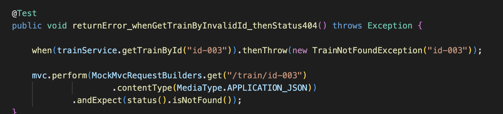

# Feedback

## Trainspotting API 🚆

1. First thing I think when I see this validation logic is that you could reuse this in other parts of your codebase. Where do you think?


2. Following on from 1. there are multiple validation methods within the fruit service - meaning that that validation logic is locked into the fruit service class at the moment. Think about how this can be made reusable in other parts of your application.

3. Just wondering why or if you need lines 177 and 178 here - do they not already happen within the helper method `saveSighting`?


4. You've got a file called `TrainServiceTests.java` which implies that this file is testing the train service - but in fact you're actually mocking the train service because I can see:
```java
 @MockitoBean
    private TrainService trainService; @MockitoBean
    private TrainService trainService;
```
which immediately tells me you're _not_ testing the train service as its being mocked in this test - what is actually being tested here?

5. I recommend to start using an automatic code formatter (something I didn't mention earlier but would be a good habit to get into at this point)


Would help with proper indenting of code like this.